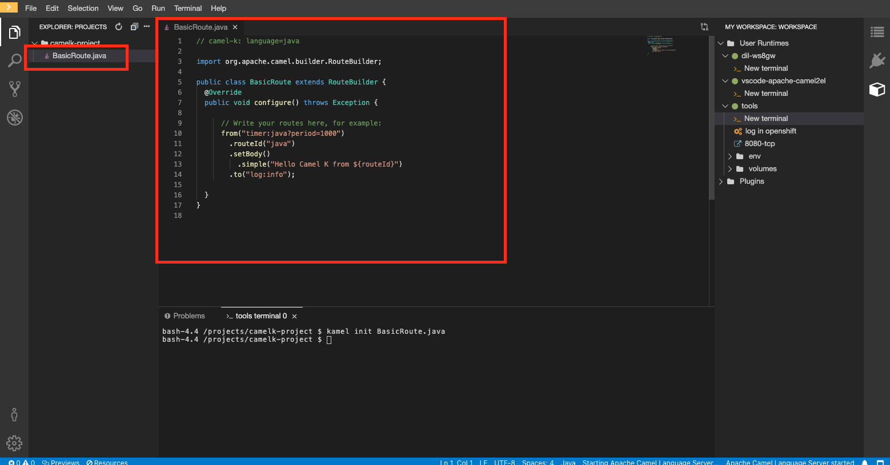

:walkthrough: Basic CamelK Deployment
:codeready-url: {che-url}
:openshift-url: {openshift-host}
:next-lab-url: ../../../tutorial/fuse-workshop-doc-walkthroughs-01-hello-router/
:user-password: openshift

= Lab 0 - Workshop Introduction

Workshop structure and environment set up.

Welcome to the Fuse workshop! It's a pleasure to guide you on this hands-on experience.

This workshop aims to offer you practical experience with Red Hat Fuse. It is not meant to be a complete training of Red Hat Fuse. For this purpose we have an amazing https://www.redhat.com/pt-br/services/training/jb421-red-hat-jboss-fuse-camel-development[official training], covering many aspects of Red Hat Fuse in depth.

The main objective is to cover as many Fuse aspects during this workshop. We will be using a https://github.com/GuilhermeCamposo/fuse-workshop.git[project skeleton] during this lab.

This *fuse-workshop* project is a Red Hat Fuse (aka https://camel.apache.org[Apache Camel]) Spring Boot project, with some code already written for you. It will help you focus on what really matters rather than having you write lots of boilerplate code.

[type=walkthroughResource,serviceName=codeready]
.CodeReady Workspaces
****
* link:{codeready-url}[Console, window="_blank"]
* link:https://developers.redhat.com/products/codeready-workspaces/overview/[Want to know more about CodeReady Workspaces?, window="_blank"]
****

[type=walkthroughResource,serviceName=openshift]
.OpenShift Console
****
* link:{openshift-url}[Console, window="_blank"]
****

.Fuse
****
* link:https://launch.openshift.io[Create new projects using Launcher, window="_blank"]
****

=== Lab Requirements

. Cloud
.. Web Browser

=== Knowledge Requirements

. Java
. OpenShift - *desirable*

[time=2]
== Setup Code Ready Workspace

These walkthroughs use link:https://developers.redhat.com/products/codeready-workspaces/overview[CodeReady Workspaces, window="_blank"] (based on https://www.eclipse.org/che[Eclipse Che]).
It's an IDE on the cloud based on containers. You can also use a local development environment if you'd prefer (i.e. https://code.visualstudio.com[Visual Studio Code], https://developers.redhat.com/products/codeready-studio/overview[Red Hat CodeReady Studio] (formerly known as JBoss Developer Studio), https://www.jetbrains.com/idea[IntelliJ IDEA], etc).

{empty} +

The *fuse-workshop* project is a Camel Spring Boot project, with some code already written for you. It will help you focus on what really matters rather than having you writing lots of boilerplate code.

.Open link:{codeready-url}/dashboard/#/ide/{user-username}/camelk-workspace[CodeReady Workspaces, window="_blank"]

{empty} +

This link you open the appropriate workspace for this workshop. If you are not already logged in, the credentials are:

* Username: `{user-username}`
* Password: `{user-password}`

image::images/01_che-workspace.png[Che Workspace, role="integr8ly-img-responsive"]

[time=5]
[type=verification]
Were you able to open the workspace?

[time=5]
== Deploying First CamelK Route

=== Initializing the project

As you could see, the workspace starts without a project. So let's create one.

. On the left panel, under *tools*, click on *New terminal*.
. This will open a terminal tab on the screen

image::images/02_new-terminal.png[Che Workspace, role="integr8ly-img-responsive"]

Let's create a folder to host our integrations. On the terminal, run:

[source,bash]
----
mkdir camelk-project
cd camelk-project
----

To interact with CamelK Operator, we are going to use the CamelK CLI (kamel). Start with a simple  help command.
In the terminal, type:

[source,bash]
----
kamel help
----

*help* shows you any available command and it's options. You may use it later to check more advance options.
For now, we are going to use the CLI to create our first route. In the terminal, under the project folder, type:

[source,bash]
----
kamel init BasicRoute.java
----

The folder and the newly created file will be visible in the *explorer tab*. Take a look at how the Java file looks like:

It's a `Camel Route` just like you learned in the `Fuse Workshop`.

CamelK works with different DSLs (Domain Specific Language) types, such as:

. Java
. YAML
. XML

For this workshop we will continue to use *Java* language.

=== Running the integration

As other Kubernetes CLI, kamel will interact with the cluster in use by the current user. So to start using kamel, we need to be logged in OpenShift.

On the left panel, click on *log in openshift*.

Once you are logged, to run the route, run the following command on the opened terminal:

[source,bash]
----
kamel run BasicRoute.java
----

If everything went as expected, you should see:

image::images/04_run.png[Che Workspace, role="integr8ly-img-responsive"]

Based on the declared route, the Camel K Operator will create a Quarkus deployment for you. You don't need to declare dependencies.
Camel K exams your code and identifies what types of Camel components are you using.

Since it is the first time you are running an integration, Camel K will create a *kit* for this route. A kit is basically a container where the image will be built.

You can also use kamel to inspect the integrations present in your project. Like this:

[source,bash]
----
kamel get
----

[time=1]
== Summary

Congratulations you finished your first example with *CamelK*!
