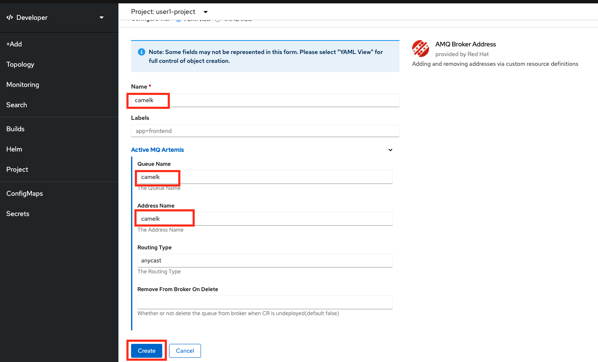
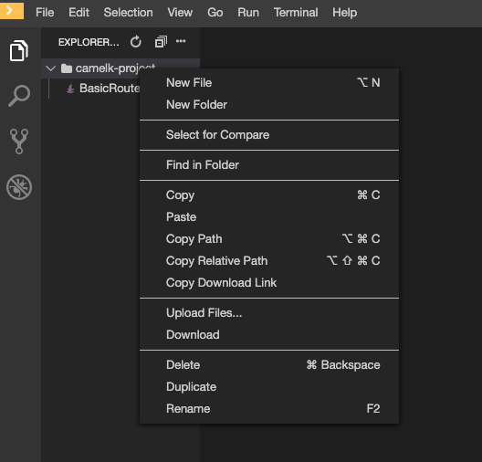
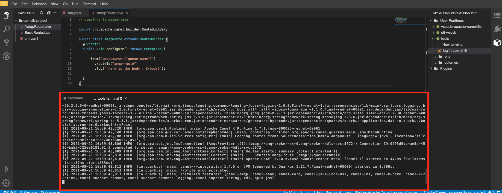
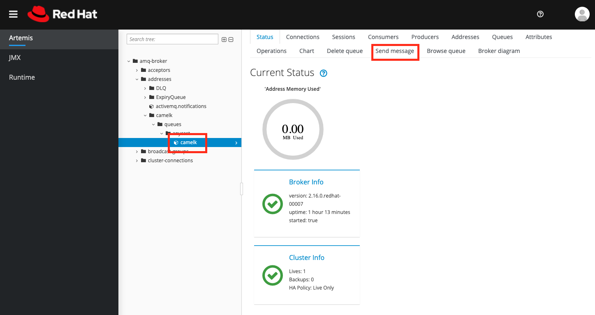
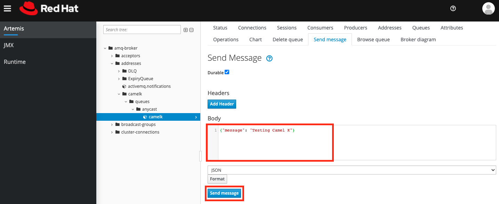
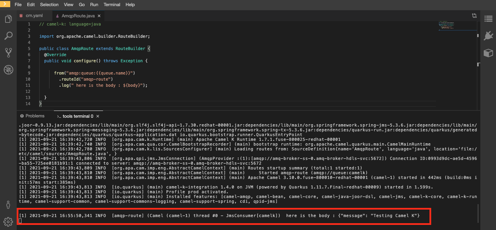

:walkthrough: Messaging and Config Files
:codeready-url: {che-url}
:openshift-url: {openshift-host}
:user-password: openshift

= Lab 2 - Messaging and Config Files

Connect to a message broker and use configmaps to change the integration configuration.

In the first lab you learned what is and how to use Camel K. Now is time to see other possibilities when writing integrations using it.

A very common good practice is to separate application logic from application configuration. In this lab you will learn how to use https://kubernetes.io/docs/concepts/configuration/configmap/[Configmaps] to configure your integration.
As an example we are going to connect to https://access.redhat.com/products/red-hat-amq/[Red Hat AMQ Broker] using the https://www.amqp.org/[AMQP] protocol.

[type=walkthroughResource,serviceName=codeready]
.CodeReady Workspaces
****
* link:{codeready-url}[Console, window="_blank"]
* link:https://developers.redhat.com/products/codeready-workspaces/overview/[Want to know more about CodeReady Workspaces?, window="_blank"]
****

[type=walkthroughResource,serviceName=openshift]
.OpenShift Console
****
* link:{openshift-url}[Console, window="_blank"]
****

[time=4]
== Setting up the environment

We are going to use the same AMQ Broker installation provisioned in the `Fuse Workshop`. I case you missed it, go back to the `Fuse Workshop - Lab 05 - Publish to OpenShift`.

For this lab we are going to need a new queue. In the `{user-username}-project` namespace, using the *Developer view*, go *+Add -> Operator Backed -> AMQ Broker Address*.

Set the *Name*, *Address name* and *Queue name* as `camelk`.

You should be able to visualize the address/queue in the AMQ web console.

[type=verification]
Did you provision the queue?

[time=4]
== Coding the integration

Let's create the file for our integration. On the explore panel, right-click on the `camelk-project` folder and add a new file.

Name it `AmqpRoute.java`. Paste the following code as it's content:

[source, java]
----
// camel-k: language=java

import org.apache.camel.builder.RouteBuilder;

public class AmqpRoute extends RouteBuilder {
  @Override
  public void configure() throws Exception {

      from("amqp:queue:{{queue.name}}")
        .routeId("amqp-route")
        .log(" here is the body : ${body}");

  }
}
----

We are using a the Camel syntax, `{{ property-key }}`, to access a property value and modify how we are declaring the route.
This is very useful because with a single route declaration, we may be able to configure this integration to work in different environments.

To access a broker we need information like the broker URL, user and password, and when using Quarkus we don't usually set them in the code, but in the `application.properties` file.

Kubernetes allow us to separate application binaries and configuration files, by using `Secrets` and `Configmaps`, and that is exactly what we are going to use, a Configmap to be used as the application properties.

Let's create a new file named `cm.yaml`. Here is the file content:

[source, yaml]
----
apiVersion: v1
kind: ConfigMap
metadata:
  name: amqp-route-cm
data:
  quarkus.qpid-jms.url: amqp://amq-broker-ss-0.amq-broker-hdls-svc:5672
  quarkus.qpid-jms.username: redhat
  quarkus.qpid-jms.password: redhat
  queue.name: camelk
----

Now we have all the required information to access the broker

[type=verification]
Did you create the files?

[time=10]
== Running and testing

Now that you have the files, is time to deploy the integration.

Log in OpenShift. On the right panel, under tools, click on `log in openshift`.

On the right panel, under tools, click on `New terminal`.

navigate to the project folder:

[source, bash]
----
cd camelk-project
----

Start by creating the Configmap in your namespace:

[source, bash]
----
oc apply -f cm.yaml
----

Run the integration:

[source, bash]
----
kamel run --configmap amqp-route-cm AmqpRoute.java
----

Wait for the kit build to finish and then start monitoring the integration logs:

[source, bash]
----
kamel logs amqp-route
----

leave the command running, we will need it later.

[type=verification]
Are your integration running?

Let's use AMQ's web console to send messages to our queue. Open it using the amq-broker route.

In case you forgot the credentials:

* Username: `redhat`
* Password: `redhat`

With the console open, in the folder structure, select the *camelk* queue. This will enable the *Send message* tab. Click on it.

You may enter the following content for your test messag:

[source, json]
----
{"message": "Testing Camel K"}
----

Paste the message and click on *Send message* button.

Go back to Codeready Workspace. The message you sent should be displayed in the logs:

[type=verification]
Are you able to visualize the message?

[time=1]
== Summary

Congratulations on finishing another lab about Camel K!
